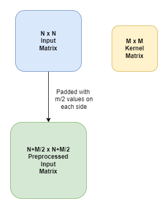
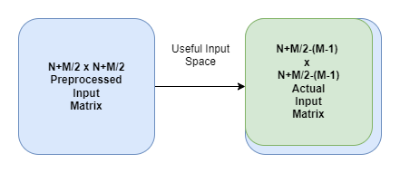
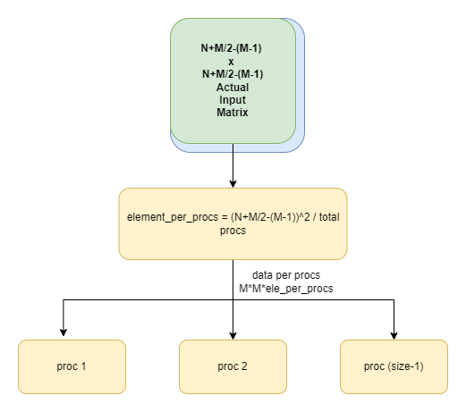

# Parallel Convolution using openMPI

## Parallelized Algorithm for calculating convulation of a matrix using a specific kernel. This implementation works but has much room for improvements and I'll try to update it accordingly. 

 

# How it works (In brief)

 

# Results

<table>
    <tr>
        <th>System Name</th>
        <th>System Config</th>
    </tr>
    <tr>
        <th>A</th>
        <th>
            Cores: 2, Ram: 4GB DDR3 
        </th>
    </tr>
    <tr>
        <th>B</th>
        <th>
            Cores: 4, Ram: 4GB DDR4 
        </th>
    </tr>
</table>

 
 

<table>
    <tr>
        <th>System</th>
        <th>Input Size</th>
        <th>Time (s)</th>
    </tr>
    <tr>
        <th>A</th>
        <th>
            100 
        </th>
        <th>
            4.5 
        </th>
    </tr>
    <tr>
        <th>A</th>
        <th>
            265 
        </th>
        <th>
            8.5 
        </th>
    </tr>
</table>

 
 

<table>
    <tr>
        <th>System</th>
        <th>Input Size</th>
        <th>Time (s)</th>
    </tr>
    <tr>
        <th>B</th>
        <th>
            100 
        </th>
        <th>
            0.07 
        </th>
    </tr>
    <tr>
        <th>B</th>
        <th>
            265 
        </th>
        <th>
            1.9 
        </th>
    </tr>
</table>